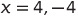

# Cubic Formula

I was recently looking into the cubic formula which is the equivalent formula to
the quadratic formula but for polynomials of degree 3 instead of 2.

The purpose of the quadratic and cubic formulas is to find all the solutions to
a polynomial of degree 2 and 3 respectively.

## The formulas

### Quadratic

### Cubic

In order to use the cubic formula you often need to deal with complex numbers,
even when solutions are 100% real.

The square roots will often produce complex numbers, and the cube roots will
always produce at least 2 complex numbers.

The imaginary parts just cancel out for solutions that are real.

## Examples

### Quadratic

The below equation (as with all quadratics) has 2 solutions:

Some quadratics have complex solutions:

### Cubic

The below equation (as with all cubics) has 3 solutions:

Some cubics have complex solutions:

## Credit

[sciweavers.org](http://www.sciweavers.org/free-online-latex-equation-editor) to create the equation images above.
